..
   Copyright 2017 Intel Corporation

   Licensed under the Apache License, Version 2.0 (the "License");
   you may not use this file except in compliance with the License.
   You may obtain a copy of the License at

       http://www.apache.org/licenses/LICENSE-2.0

   Unless required by applicable law or agreed to in writing, software
   distributed under the License is distributed on an "AS IS" BASIS,
   WITHOUT WARRANTIES OR CONDITIONS OF ANY KIND, either express or implied.
   See the License for the specific language governing permissions and
   limitations under the License.

**********
Scenarios
**********

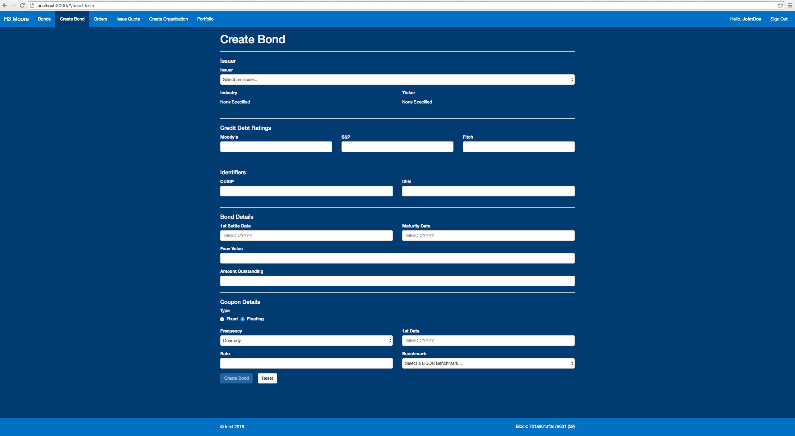

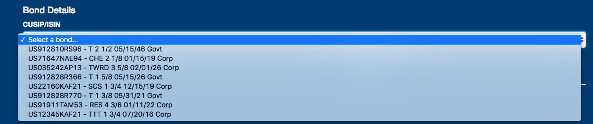

.. |cusip| image:: scenarioimages/cusip_or_isin.png

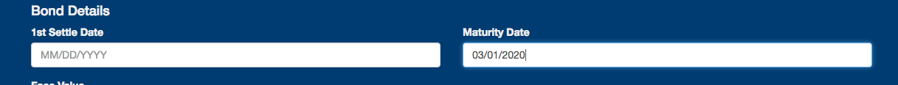

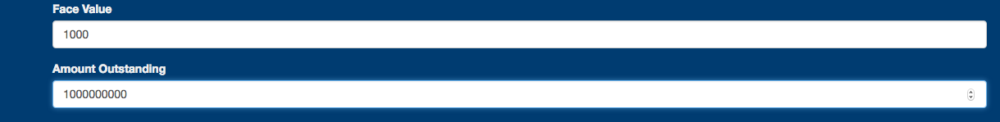

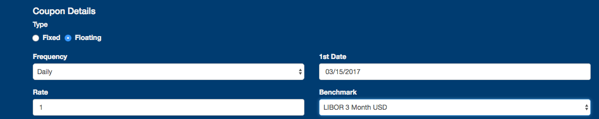

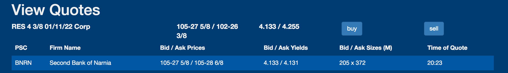

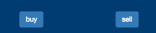

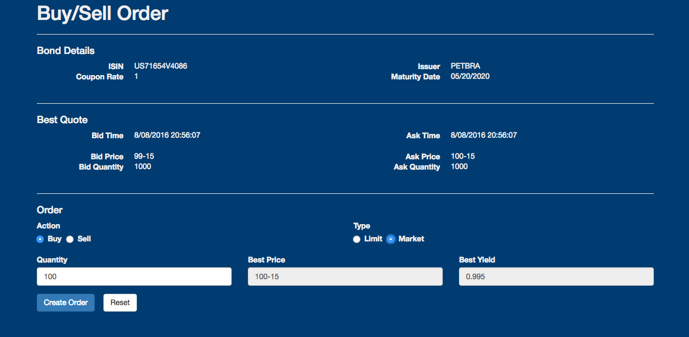

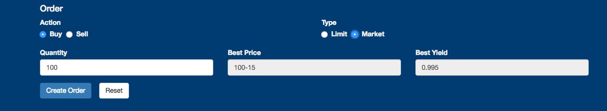

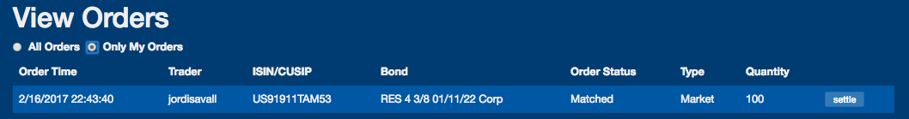

.. |settled| image:: scenarioimages/settled.png

Scenario A
----------
Scenario A is the issuance of a corporate bond along with the order of the
bond and settlement.

**Issuing a corporate bond**

* Agent

+----------------------------------------+--------------------------+
| Start at the Create Bond tab.          |       |bond_screen|      |
|  All fields not mentioned are optional |                          |
+----------------------------------------+--------------------------+
+-------------------------------------------------------------------+
|  |issuer|                                                         |
+-------------------------------------------------------------------+
|Choose an issuer of the bond.                                      |
+-------------------------------------------------------------------+
+-------------------------------------------------------------------+
| |cusip|                                                           |
+-------------------------------------------------------------------+
|Enter either a valid Cusip or Isin.                                |
+-------------------------------------------------------------------+
+-------------------------------------------------------------------+
|    |matdate|                                                      |
+-------------------------------------------------------------------+
|Enter a maturity date in the future.                               |
+-------------------------------------------------------------------+
+-------------------------------------------------------------------+
|  |facevalue|                                                      |
+-------------------------------------------------------------------+
| Enter the face value, and amount outstanding.                     |
+-------------------------------------------------------------------+
+-------------------------------------------------------------------+
|  |coupon|                                                         |
+-------------------------------------------------------------------+
| Enter the coupon details.                                         |
+-------------------------------------------------------------------+
+-------------------------------------------------------------------+
| |clickbond| |toastbond|                                           |
+-------------------------------------------------------------------+
| Click the Create Bond button.                                     |
+-------------------------------------------------------------------+

* Trader

+-------------------------------------------------------------------+
|  |bondquote|                                                      |
+-------------------------------------------------------------------+
| A quote has been made on the bond just issued                     |
+-------------------------------------------------------------------+
+-------------------------------------------------------------------+
||viewquotes|                                                       |
+-------------------------------------------------------------------+
|Click on View Quotes and see the View                              |
|Quotes screen                                                      |
+-------------------------------------------------------------------+
+--------------------------------------+----------------------------+
| Click either Buy or Sell             |    |buysell|               |
|                                      |                            |
+--------------------------------------+----------------------------+
+--------------------------------------+----------------------------+
| View the Buy/Sell screen             |  |buyscreen|               |
+--------------------------------------+----------------------------+
+-------------------------------------------------------------------+
| |buyorder|                                                        |
+-------------------------------------------------------------------+
| Make either a market or a limit order                             |
+-------------------------------------------------------------------+
+-------------------------------------------------------------------+
| |marketorder|                                                     |
+-------------------------------------------------------------------+
| Since it was a market order, it was matched on the next block.    |
+-------------------------------------------------------------------+
+-------------------------------------------------------------------+
| |settled|                                                         |
+-------------------------------------------------------------------+
|Press settle and the system settles the transaction.               |
+-------------------------------------------------------------------+

Scenario B
----------
Scenario B involves a trader purchasing a US Treasury Bond

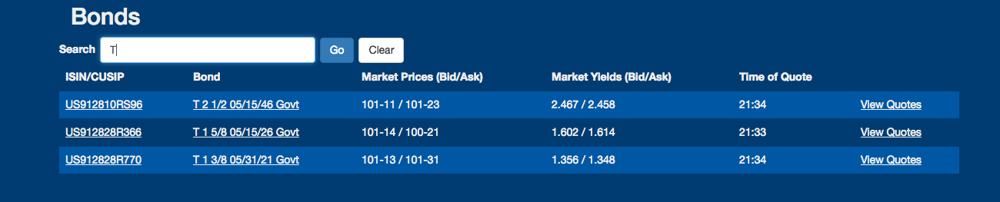

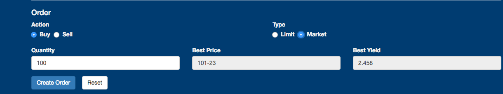

* Trader

+-------------------------------------------------------------------+
|  |search|                                                         |
+-------------------------------------------------------------------+
| Search for Treasury bonds and press View Quotes.                  |
+-------------------------------------------------------------------+
+-------------------------------------------------------------------+
| |govtbuy|                                                         |
+-------------------------------------------------------------------+
| After choosing Buy while viewing quotes, submit a Buy order.      |
+-------------------------------------------------------------------+
+-------------------------------------------------------------------+
| |matched|                                                         |
+-------------------------------------------------------------------+
| The system matches the order with a quote.                        |
+-------------------------------------------------------------------+
+-------------------------------------------------------------------+
| |settle|                                                          |
+-------------------------------------------------------------------+
| Press settle and the system settles the transaction.              |
+-------------------------------------------------------------------+
