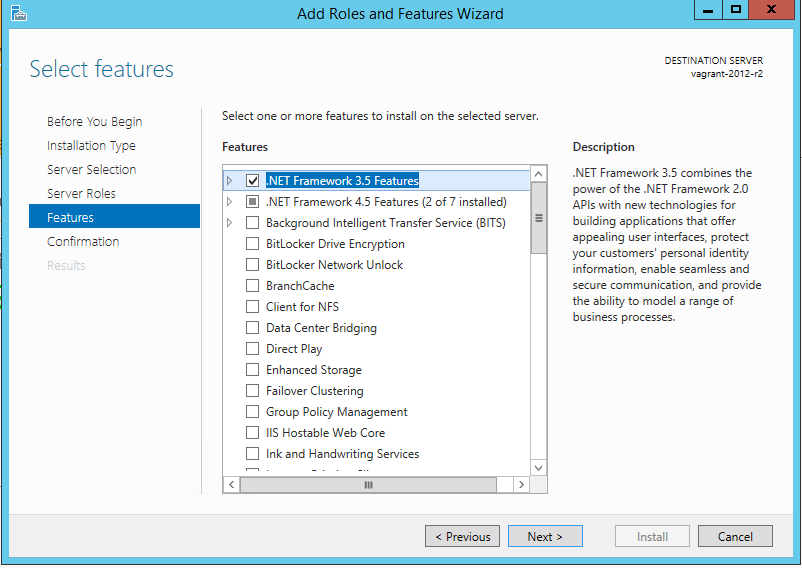
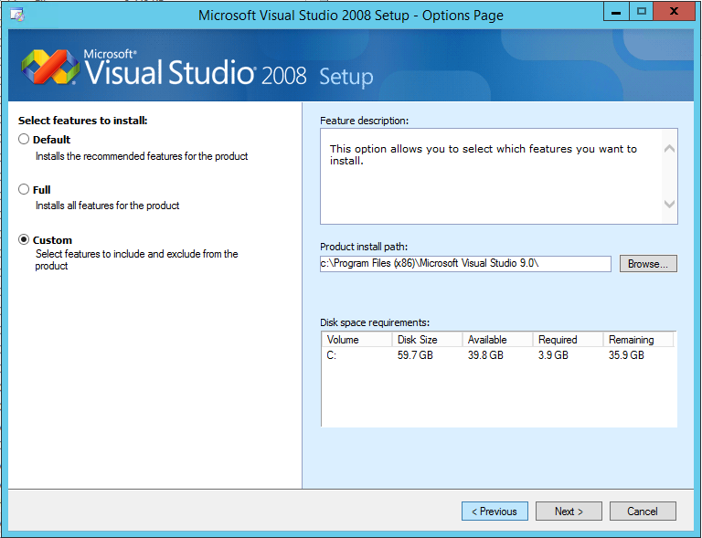
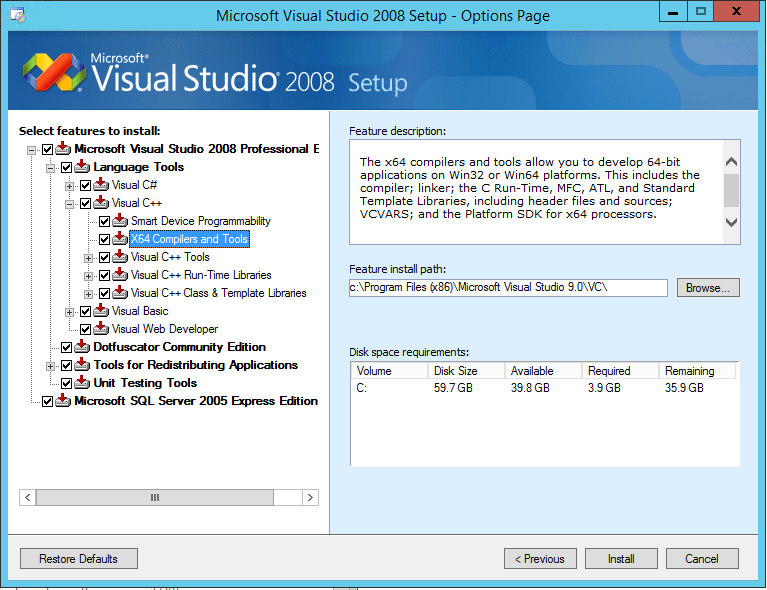
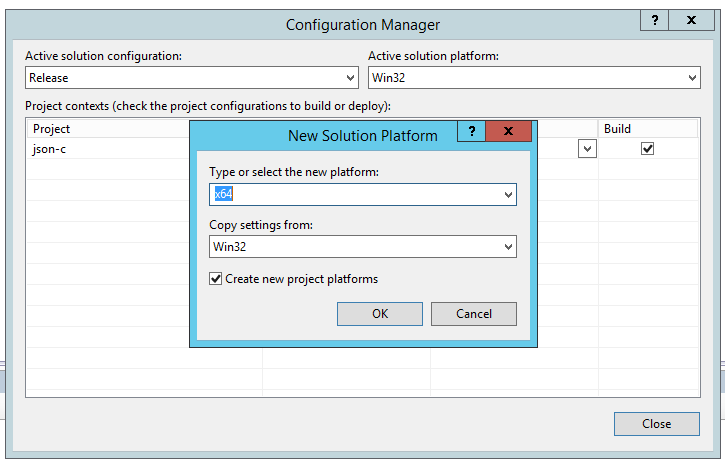

*****************************
Creating Packages for Windows
*****************************

Prerequisites
=============

To create packages for Windows, you need the following:

* Windows Server 2012R2 or Windows 8.1
* .Net Framework 3.5
* Visual Studio 2008
* Microsoft Visual C++ Compiler for Python 2.7 (VCForPython27.msi)
* Python 2.7.11 Windows x86-64 MSI Installer (python-2.7.11.amd64.msi)
* SWIG 3.0.7 (swigwin-3.0.7.zip)
* NSIS 2.50 (nsis-2.50-setup.exe)
* Crypto++ 5.6.1 (cryptopp561.zip)
* json-c 0.11 (json-c-0.11.tar.gz)

Download Visual C++ Compiler for Python 2.7 (VCForPython27.msi) from:

  http://www.microsoft.com/en-us/download/details.aspx?id=44266

Download Python Windows x86-64 MSI Installer (python-2.7.11.amd64.msi) from:
 
  https://www.python.org/downloads/windows/

Download the Swig 3.0.7 (swigwin-3.0.7.zip) pre-built package from:
 
  http://www.swig.org/download.html 

Download the NSIS installer (nsis-2.50-setup.exe) from:

  http://nsis.sourceforge.net/Download

Download cryptopp561.zip from:

  https://www.cryptopp.com/#download

Download json-c-011.tar.gz from:

  https://s3.amazonaws.com/json-c_releases/releases/index.html

The remainder of these instructions assume a vanilla Windows 2012R2
machine as a starting point.

Install Tools
=============

Install .Net Framework 3.5
--------------------------

On Windows Server 2012R2:

* Open Server Manager> Add Roles and Features>
* Click Next until you get to Features
* Check .Net Framework 3.5 Features

* Click Install

Install Visual Studio 2008
--------------------------

If you don't have a copy, a trial version is available at:

http://download.microsoft.com/download/8/1/d/81d3f35e-fa03-485b-953b-ff952e402520/VS2008ProEdition90dayTrialENUX1435622.iso

* Click Install Visual Studio 2008>
  Accept license terms and click Next>
  Select Custom and click Next>

* Expand "Visual C++" check X64 C++ Compilers and Tools

* Click Install. The installation process may take around ten minutes to
  complete

* Launch Visual Studio. Select Visual C++ Development Settings

Install Microsoft Visual C++ Compiler for Python 2.7
----------------------------------------------------

Install Microsoft Visual C++ Compiler for Python 2.7 using the
VCForPython27.msi package:

.. code-block:: console

  PS C:\Users\username> cd .\Download
  PS C:\Users\username\Downloads> msiexec /i VCForPython27.msi ALLUSERS=1

.. note::

  If you don't have administrator rights, the above command should be
  executed without ALLUSERS=1.

Install Python
--------------

Use the Python 2.7.11 Windows x86-64 MSI Installer (python-2.7.11.amd64.msi)
to install Python.  You may be asked to reboot.

Install SWIG
------------

Unzip the contents of swigwin-3.0.7.zip to ``c:\swig``.

Install NSIS
------------

Use the NSIS 2.50 Installer to install NSIS to the default location.

Compile and Install Source Dependencies
=======================================

Crypto++
--------

Extract cryptopp561.zip
^^^^^^^^^^^^^^^^^^^^^^^

Extract cryptopp561.zip to two locations:

* ``C:\build\cryptop561``
* ``C:\Program Files (x86)\Common Files\Microsoft\Visual C++ for Python\9.0\VC\include\cryptopp``

.. note::

  If you installed VCForPython27.msi without administrator rights, the
  destination path is
  ``C:\Users\username\AppData\Local\Programs\Common\Microsoft\Visual C++ for Python\9.0\VC\include\cryptopp``

Source Code Modifications
^^^^^^^^^^^^^^^^^^^^^^^^^

We need to add the CRYPTOPP_DLL macro to the class definitions in base32.h
in order to export some additional non-FIPS functions. This patch should be
applied to the files in ``c:\build\cryptop561``:

.. code-block:: diff

  --- base32.h.old  2015-12-22 19:51:01.000000000 -0600
  +++ base32.h  2015-12-21 17:45:06.000000000 -0600
  @@ -7,7 +7,7 @@
   
   //! Converts given data to base 32, the default code is based on draft-ietf-idn-dude-02.txt
   /*! To specify alternative code, call Initialize() with EncodingLookupArray parameter. */
  -class Base32Encoder : public SimpleProxyFilter
  +class CRYPTOPP_DLL Base32Encoder : public SimpleProxyFilter
   {
   public:
    Base32Encoder(BufferedTransformation *attachment = NULL, bool uppercase = true, int outputGroupSize = 0, const std::string &separator = ":", const std::string &terminator = "")
  @@ -21,7 +21,7 @@
   
   //! Decode base 32 data back to bytes, the default code is based on draft-ietf-idn-dude-02.txt
   /*! To specify alternative code, call Initialize() with DecodingLookupArray parameter. */
  -class Base32Decoder : public BaseN_Decoder
  +class CRYPTOPP_DLL Base32Decoder : public BaseN_Decoder
   {
   public:
    Base32Decoder(BufferedTransformation *attachment = NULL)

Build
^^^^^

Import the Crypto++ project into Visual Studio:

* Open VS 2008
* File> Open Solution> Navigate to ``c:\build\cryptopp561`` and select
  cryptest.sln
* A box will pop up asking you to convert the solution. You can click
  "Finish" and then "Close"

We'll need to first build the 32-bit configuration in order for the 64-bit 
libraries to work correctly:

* Change the Solution Configuration dropdown from "Debug" to "Release"
* Select Build> Build Solution from the menu. You can also initate a build by
  pressing the F7 key.

After the build completes, build the 64-bit libraries.

* Change the Solution Configuration dropdown from "Release" to
  "Dll-Import Release"
* Change Platform to x64
* Build the solution
* This sometimes needs to be run twice in order to produce usable libraries

The build artifacts are placed in
``c:\build\cryptopp561\x64\DLL_Output\Release``

JSON-C
------

Extract json-c-011.tar.gz
^^^^^^^^^^^^^^^^^^^^^^^^^

Extract json-c-011.tar.gz to two locations:

* ``C:\build\json-c-0.11``
* ``C:\Program Files (x86)\Common Files\Microsoft\Visual C++ for Python\9.0\VC\include\json-c``

.. note::

  If you installed VCForPython27.msi without administrator rights, the
  destination path is
  ``C:\Users\username\AppData\Local\Programs\Common\Microsoft\Visual C++ for Python\9.0\VC\include\json-c``

Source Code Modifications
^^^^^^^^^^^^^^^^^^^^^^^^^

A few changes need to be made so JSON-C will properly build on windows.
These patches should be applied to the files in ``c:\build\json-c-0.11``

Changes to c:\\build\\json-c-0.11\\json_util.c:

.. code-block:: diff

  --- json_util.c.old 2013-03-31 21:01:09.000000000 -0500
  +++ json_util.c 2015-12-22 11:07:56.000000000 -0600
  @@ -40,6 +40,7 @@
   # define WIN32_LEAN_AND_MEAN
   # include <windows.h>
   # include <io.h>
  +# define snprintf _snprintf
   #endif /* defined(WIN32) */
   
   #if !defined(HAVE_OPEN) && defined(WIN32)
  @@ -158,15 +159,19 @@
    */
   static void sscanf_is_broken_test()
   {
  + int ret_errno;
    int64_t num64;
  + int is_int64_min;
  + int ret_errno2;
  + int is_int64_max;

    (void)sscanf(" -01234567890123456789012345", "%" SCNd64, &num64);
  - int ret_errno = errno;
  - int is_int64_min = (num64 == INT64_MIN);
  + ret_errno = errno;
  + is_int64_min = (num64 == INT64_MIN);
   
    (void)sscanf(" 01234567890123456789012345", "%" SCNd64, &num64);
  - int ret_errno2 = errno;
  - int is_int64_max = (num64 == INT64_MAX);
  + ret_errno2 = errno;
  + is_int64_max = (num64 == INT64_MAX);

    if (ret_errno != ERANGE || !is_int64_min ||
        ret_errno2 != ERANGE || !is_int64_max)

Changes to c:\\build\\json-c-0.11\\json_object.c:

.. code-block:: diff

  --- json_object.c.old 2015-12-22 20:17:02.000000000 -0600
  +++ json_object.c 2015-12-22 20:16:48.000000000 -0600
  @@ -37,6 +37,10 @@
     char* strndup(const char* str, size_t n);
   #endif /* !HAVE_STRNDUP */
   
  +#ifdef WIN32
  +# define snprintf _snprintf
  +#endif /* defined(WIN32) */
  +
   // Don't define this.  It's not thread-safe.
   /* #define REFCOUNT_DEBUG 1 */

Build
^^^^^

* Copy ``c:\build\json-c-0.11\config.h.win32`` to 
  ``c:\build\json-c-0.11\config.h``

* Open VS 2008
* File> Open Solution> Navigate to ``c:\build\json-c-0.11`` and select
  json-c.sln
* A box will pop up asking you to convert the solution. You can click
  "Finish" and then "Close"

* Build> Configuration Manager>
* Click the "Active solution plaform" drop-down and select "New"
* Select "x64" from the "Type or select the new platform" dropdown

* Click OK, then Close

* Change the Solution Configuration dropdown from "Debug" to "Release"
* Change Platform to x64
* Build the solution

Build artifacts are placed in ``c:\build\json-c-0.11\x64\Release``

Build Sawtooth Lake Package
===========================

* Open Windows Powershell and set some environment variables

.. code:: console

  PS C:\Users\username> $env:path += ”;c:\swig;c:\python27;C:\Program Files (x86)\NSIS”
  PS C:\Users\username> $env:PYTHONPATH += ";C:\Program Files (x86)\Intel\sawtooth-validator\lib\python\"

* Copy cryptlib.lib and cryptopp.lib to ``c:\Python27\libs\``

.. code:: console

  PS C:\users\username> cp C:\build\cryptopp561\x64\DLL_Output\Release\cryptlib.lib C:\Python27\Libs
  PS C:\users\username> cp C:\build\cryptopp561\x64\DLL_Output\Release\cryptopp.lib C:\Python27\Libs

* Copy json.lib to ``c:\Python27\libs\`` as json-c.lib

.. code:: console

  PS C:\users\username> cp C:\build\json-c-0.11\x64\Release\json.lib C:\Python27\Libs\json-c.lib

* Create the destination directory

.. code:: console

  PS C:\users\username> mkdir "C:\Program Files (x86)\Intel\sawtooth-validator\lib\python"

* Clone the git sawtooth, sawtooth-validator and marketplace git repositories into
  ``c:\build``

* Navigate to the directories and create the build artifacts

.. code:: console

  PS C:\build> cd sawtooth-core
  PS C:\build\sawtooth-core> python setup.py install --home='C:\Program Files (x86)\Intel\sawtooth-validator'

* Copy cryptopp.dll into the Ledger libs directory

.. code:: console

  PS C:\build> cp C:\build\cryptopp561\x64\DLL_Output\Release\cryptopp.dll "C:\Program Files (x86)\Intel\sawtooth-validator\lib\python\sawtooth-core-<version>-py2.7.egg\"

* Copy the packaging script from the sawtooth-validator repository to ``C:\Program Files (x86)\Intel\``

.. code:: console

  PS C:\build> cp c:\build\sawtooth-core\validator\packaging\sawtooth-validator.nsi "C:\Program Files (x86)\Intel\"

* Run NSIS to create the installer package

.. code:: console

  PS C:\build> makensis 'C:\Program Files (x86)\Intel\sawtooth-validator.nsi'

* sawtooth-validator.exe will be created in ``C:\Program Files (x86)\Intel``
